# 🛒 SOA Sales Service - Ejemplos Prácticos

## 📋 Introducción
Este documento proporciona ejemplos prácticos y casos de uso reales para trabajar con el servicio de ventas y sus detalles.

## 🎯 Escenarios de Uso

### 1. **Creación de Venta Completa**

#### Escenario: Venta de Evento con Múltiples Tickets
Un usuario compra 3 tickets para un evento con diferentes precios.

**Request:**
```bash
curl -X POST http://localhost:2226/api/sales \
  -H "Content-Type: application/json" \
  -d '{
    "userId": 123,
    "partnerId": 456,
    "totalAmount": 275.00,
    "saleDetails": [
      {
        "ticketId": 1001,
        "amount": 100.00
      },
      {
        "ticketId": 1002,
        "amount": 100.00
      },
      {
        "ticketId": 1003,
        "amount": 75.00
      }
    ]
  }'
```

**Response:**
```json
{
  "id": 1,
  "userId": 123,
  "partnerId": 456,
  "totalAmount": 275.00,
  "createdAt": "2024-01-15T14:30:00Z",
  "updatedAt": "2024-01-15T14:30:00Z",
  "isActive": true,
  "deleted": false,
  "saleDetails": [
    {
      "id": 1,
      "saleId": 1,
      "ticketId": 1001,
      "amount": 100.00,
      "createdAt": "2024-01-15T14:30:00Z",
      "isActive": true
    },
    {
      "id": 2,
      "saleId": 1,
      "ticketId": 1002,
      "amount": 100.00,
      "createdAt": "2024-01-15T14:30:00Z",
      "isActive": true
    },
    {
      "id": 3,
      "saleId": 1,
      "ticketId": 1003,
      "amount": 75.00,
      "createdAt": "2024-01-15T14:30:00Z",
      "isActive": true
    }
  ]
}
```

### 2. **Consulta de Ventas con Paginación**

#### Escenario: Dashboard de Administrador
Mostrar las últimas 10 ventas en un dashboard.

**Request:**
```bash
curl -X GET "http://localhost:2226/api/sales?page=1&items=10"
```

**Response:**
```json
{
  "sales": [
    {
      "id": 1,
      "userId": 123,
      "partnerId": 456,
      "totalAmount": 275.00,
      "createdAt": "2024-01-15T14:30:00Z",
      "saleDetails": [...]
    },
    {
      "id": 2,
      "userId": 124,
      "partnerId": 457,
      "totalAmount": 150.00,
      "createdAt": "2024-01-15T13:45:00Z",
      "saleDetails": [...]
    }
  ],
  "count": 25
}
```

### 3. **Búsqueda de Ventas por Usuario**

#### Escenario: Historial de Compras
Un usuario quiere ver su historial de compras.

**Request:**
```bash
curl -X GET http://localhost:2226/api/sales/user/123
```

**Response:**
```json
[
  {
    "id": 1,
    "userId": 123,
    "partnerId": 456,
    "totalAmount": 275.00,
    "createdAt": "2024-01-15T14:30:00Z",
    "saleDetails": [...]
  },
  {
    "id": 5,
    "userId": 123,
    "partnerId": 458,
    "totalAmount": 200.00,
    "createdAt": "2024-01-10T09:15:00Z",
    "saleDetails": [...]
  }
]
```

### 4. **Actualización de Venta**

#### Escenario: Corrección de Monto
Se necesita corregir el monto total de una venta.

**Request:**
```bash
curl -X PUT http://localhost:2226/api/sales \
  -H "Content-Type: application/json" \
  -d '{
    "id": 1,
    "totalAmount": 280.00
  }'
```

**Response:**
```json
{
  "id": 1,
  "userId": 123,
  "partnerId": 456,
  "totalAmount": 280.00,
  "updatedAt": "2024-01-15T15:00:00Z",
  "saleDetails": [...]
}
```

### 5. **Actualización de Detalle de Venta**

#### Escenario: Ajuste de Precio de Ticket
Se necesita ajustar el precio de un ticket específico.

**Request:**
```bash
curl -X PUT http://localhost:2226/api/sales/details \
  -H "Content-Type: application/json" \
  -d '{
    "id": 1,
    "amount": 105.00
  }'
```

**Response:**
```json
{
  "id": 1,
  "saleId": 1,
  "ticketId": 1001,
  "amount": 105.00,
  "updatedAt": "2024-01-15T15:30:00Z",
  "isActive": true
}
```

### 6. **Obtención de Estadísticas**

#### Escenario: Reporte de Ventas
Generar un reporte con estadísticas generales.

**Request:**
```bash
curl -X GET http://localhost:2226/api/sales/statistics
```

**Response:**
```json
{
  "totalSales": 1250,
  "activeSales": 1200,
  "totalRevenue": 62500.00,
  "averageSaleAmount": 50.00
}
```

### 7. **Desactivación de Venta**

#### Escenario: Cancelación de Venta
Una venta necesita ser cancelada pero no eliminada.

**Request:**
```bash
curl -X POST http://localhost:2226/api/sales/1/deactivate
```

**Response:**
```json
{
  "message": "Sale deactivated successfully"
}
```

### 8. **Eliminación de Detalle**

#### Escenario: Eliminación de Ticket
Se necesita eliminar un ticket de una venta.

**Request:**
```bash
curl -X DELETE http://localhost:2226/api/sales/details/1/delete
```

**Response:**
```json
{
  "message": "Sale detail deleted successfully",
  "result": {
    "affected": 1
  }
}
```

## 🔄 Flujos de Trabajo Complejos

### Flujo 1: Proceso de Venta Completo


### Flujo 2: Gestión de Detalles

```mermaid
sequenceDiagram
    participant C as Cliente
    participant S as Sales Service
    participant DB as Database
    
    C->>S: GET /api/sales/1/details (ver detalles)
    S->>DB: Buscar detalles de venta
    S->>C: Retornar detalles
    
    C->>S: PUT /api/sales/details (actualizar detalle)
    S->>S: Validar detalle existe
    S->>DB: Actualizar detalle
    S->>C: Retornar detalle actualizado
    
    C->>S: DELETE /api/sales/details/1/delete
    S->>DB: Soft delete detalle
    S->>C: Confirmar eliminación
```



## 📊 Casos de Uso Específicos

### Caso 1: Venta de Evento Masivo
```json
{
  "userId": 789,
  "partnerId": 101,
  "totalAmount": 1500.00,
  "saleDetails": [
    {"ticketId": 2001, "amount": 50.00},
    {"ticketId": 2002, "amount": 50.00},
    {"ticketId": 2003, "amount": 50.00},
    {"ticketId": 2004, "amount": 50.00},
    {"ticketId": 2005, "amount": 50.00},
    {"ticketId": 2006, "amount": 50.00},
    {"ticketId": 2007, "amount": 50.00},
    {"ticketId": 2008, "amount": 50.00},
    {"ticketId": 2009, "amount": 50.00},
    {"ticketId": 2010, "amount": 50.00},
    {"ticketId": 2011, "amount": 50.00},
    {"ticketId": 2012, "amount": 50.00},
    {"ticketId": 2013, "amount": 50.00},
    {"ticketId": 2014, "amount": 50.00},
    {"ticketId": 2015, "amount": 50.00},
    {"ticketId": 2016, "amount": 50.00},
    {"ticketId": 2017, "amount": 50.00},
    {"ticketId": 2018, "amount": 50.00},
    {"ticketId": 2019, "amount": 50.00},
    {"ticketId": 2020, "amount": 50.00},
    {"ticketId": 2021, "amount": 50.00},
    {"ticketId": 2022, "amount": 50.00},
    {"ticketId": 2023, "amount": 50.00},
    {"ticketId": 2024, "amount": 50.00},
    {"ticketId": 2025, "amount": 50.00},
    {"ticketId": 2026, "amount": 50.00},
    {"ticketId": 2027, "amount": 50.00},
    {"ticketId": 2028, "amount": 50.00},
    {"ticketId": 2029, "amount": 50.00},
    {"ticketId": 2030, "amount": 50.00}
  ]
}
```

### Caso 2: Venta con Descuento
```json
{
  "userId": 456,
  "partnerId": 202,
  "totalAmount": 85.00,
  "saleDetails": [
    {
      "ticketId": 3001,
      "amount": 100.00
    }
  ]
}
```

### Caso 3: Venta Corporativa
```json
{
  "userId": 999,
  "partnerId": 303,
  "totalAmount": 5000.00,
  "saleDetails": [
    {"ticketId": 4001, "amount": 250.00},
    {"ticketId": 4002, "amount": 250.00},
    {"ticketId": 4003, "amount": 250.00},
    {"ticketId": 4004, "amount": 250.00},
    {"ticketId": 4005, "amount": 250.00},
    {"ticketId": 4006, "amount": 250.00},
    {"ticketId": 4007, "amount": 250.00},
    {"ticketId": 4008, "amount": 250.00},
    {"ticketId": 4009, "amount": 250.00},
    {"ticketId": 4010, "amount": 250.00},
    {"ticketId": 4011, "amount": 250.00},
    {"ticketId": 4012, "amount": 250.00},
    {"ticketId": 4013, "amount": 250.00},
    {"ticketId": 4014, "amount": 250.00},
    {"ticketId": 4015, "amount": 250.00},
    {"ticketId": 4016, "amount": 250.00},
    {"ticketId": 4017, "amount": 250.00},
    {"ticketId": 4018, "amount": 250.00},
    {"ticketId": 4019, "amount": 250.00},
    {"ticketId": 4020, "amount": 250.00}
  ]
}
```

## 🛠️ Herramientas de Desarrollo

### Scripts de Prueba

#### Crear Múltiples Ventas de Prueba
```bash
#!/bin/bash
# Script para crear ventas de prueba

for i in {1..10}; do
  curl -X POST http://localhost:2226/api/sales \
    -H "Content-Type: application/json" \
    -d "{
      \"userId\": $i,
      \"partnerId\": $((i % 5 + 1)),
      \"totalAmount\": $((RANDOM % 500 + 50)).00,
      \"saleDetails\": [
        {
          \"ticketId\": $((1000 + i)),
          \"amount\": $((RANDOM % 200 + 25)).00
        }
      ]
    }"
  echo "Venta $i creada"
done
```

#### Generar Reporte de Estadísticas
```bash
#!/bin/bash
# Script para generar reporte

echo "=== REPORTE DE VENTAS ==="
echo "Fecha: $(date)"
echo ""

echo "Estadísticas Generales:"
curl -s http://localhost:2226/api/sales/statistics | jq '.'

echo ""
echo "Últimas 5 Ventas:"
curl -s "http://localhost:2226/api/sales?page=1&items=5" | jq '.sales[] | {id, userId, totalAmount, createdAt}'
```

## 🔍 Debugging y Troubleshooting

### Errores Comunes

#### 1. Error de Validación
```json
{
  "message": "totalAmount must be a positive number"
}
```
**Solución**: Verificar que el monto total sea un número positivo.

#### 2. Error de Venta No Encontrada
```json
{
  "message": "Sale with ID 999 not found"
}
```
**Solución**: Verificar que el ID de la venta existe.

#### 3. Error de Detalle No Encontrado
```json
{
  "message": "Sale detail with ID 999 not found"
}
```
**Solución**: Verificar que el ID del detalle existe.

### Logs de Debug
```bash
# Habilitar logs detallados
curl -X GET http://localhost:2226/api/sales/1 -v
```

## 📈 Monitoreo y Métricas

### Métricas Clave a Monitorear
- **Tasa de Creación de Ventas**: Ventas por minuto/hora
- **Tiempo de Respuesta**: Latencia de los endpoints
- **Tasa de Error**: Errores por endpoint
- **Uso de Recursos**: CPU, memoria, base de datos

### Health Check Detallado
```bash
curl -X GET http://localhost:2226/api/health
```

**Respuesta Esperada:**
```json
{
  "status": "OK",
  "message": "SOA Sales API is running",
  "timestamp": "2024-01-15T16:00:00.000Z",
  "version": "1.0.0",
  "uptime": "2h 30m 15s"
}
```

## 🎯 Próximos Pasos

1. **Implementar Autenticación**: JWT tokens
2. **Agregar Rate Limiting**: Protección contra spam
3. **Implementar Caching**: Redis para consultas frecuentes
4. **Agregar Webhooks**: Notificaciones en tiempo real
5. **Implementar Auditoría**: Log de cambios
6. **Agregar Exportación**: CSV/PDF de reportes
7. **Implementar Búsqueda**: Filtros avanzados
8. **Agregar Notificaciones**: Email/SMS de confirmación 